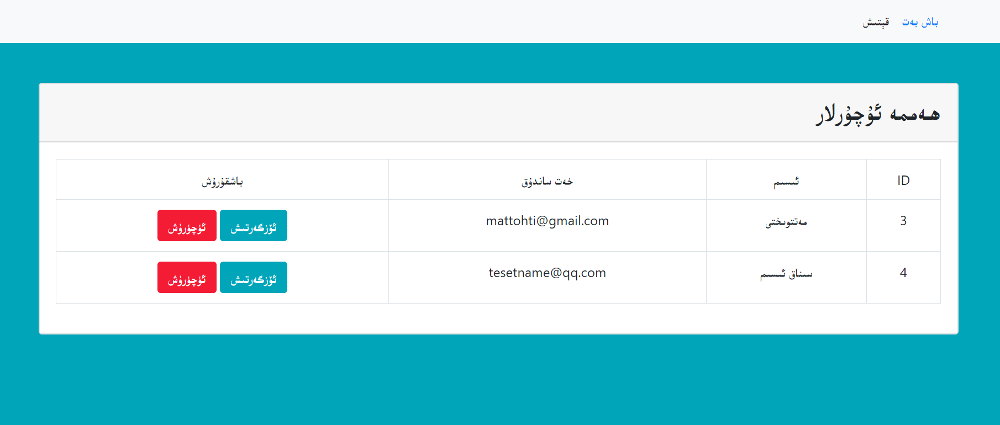
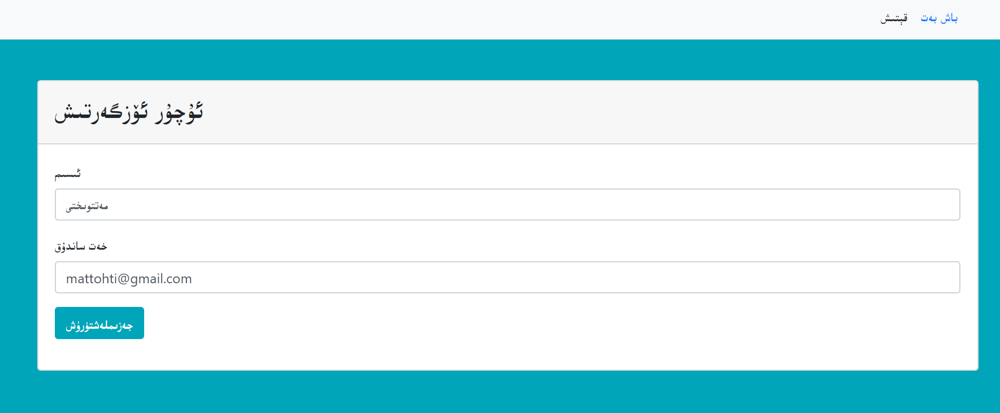
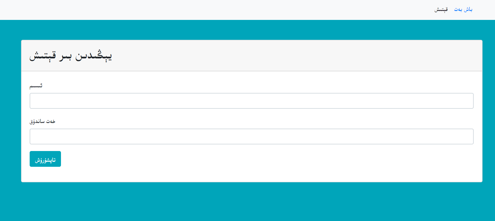

# curd
用php写了简单的curd系统，用bt，

用户界面可以看看，特别的简单，适合初学者

数据库部分代码:
```sql
create database students;
 use students;

 create table person(
     id int(11) auto_increment primary key,
     name varchar(30) not null,
     email varchar(30) not null
 );

 SELECT * FROM person;
 DELETE FROM person WHERE id=:id
 INSERT INTO person (username,email) VALUES(:username,:email)
 
```
用的是bootstrap，但额外的添加字体，

```css
@font-face {
    font-family: 'uyfont';
    src: local('UKIJ Esliye');
    unicode-range: 	U+0600-06FF;
  }
*{
    font-family: uyfont,'Segoe UI', Tahoma, Geneva, Verdana, sans-serif;
}
td{
    text-align: center;
}
```




